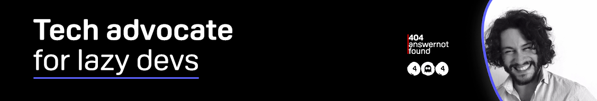

  

<h2>Long story short</h2>
<h3>Digital Techy Nerd creating content for unexistent readers, finder of problems to known solutions</h3>
    Are you a Notion fan? :) <a href="404answernotfound.notion.site">Here's my public Notion profile</a>!

     
  

# Currently reading 
- Wohpe, Salvatore Sanfilippo [link to Amzn](https://www.amazon.it/Wohpe-Salvatore-Sanfilippo/dp/B09XT6J3WX)
- Building a Second Brain, Thiago Forte [link to Amzn](https://www.amazon.com/Building-Second-Brain-Organize-Potential/dp/1982167386)
- The Programmer's Brain, Felienne Hermans [link to Amzn](https://www.amazon.com/Programmers-Brain-every-programmer-cognition/dp/1617298670)
# Latest Projects 
- A journey around Web Development made sustainable for the environment, [https://envirotechnical.eu](https://envirotechnical.eu/)
- Flig, a `git` wrapper with strong opinions
- Kryp (from the greek κρυπτός / kryptos, `to conceal`), a secrets manager

# Latest Talks 
- Greta is not happy with your website, and she is right - Codemotion 2022 Milan [Slides](https://envirotechnical.eu/)
- Interplanetary guide to Open Source - Hacktoberfest @ Pisa.dev [Slides](https://404answernotfound.github.io/talks/interplanetary-guide-to-opensource-hacktoberfest-2022/slides/)
- How to negotiate and talk about salary expectations without too much hassle - Lavoro Digitale Italia 

# 🐯 About Me

🇮🇹 Hello, this is Lorenzo 
🤖 I’m looking to collaborate on **Open Source Projects** 
👾 **My weapons of choice**: Javascript, Typescript, NodeJS, GraphQL, PostgresQL, Python, Bash 
📚 **What am I studying right now?** Rust, GCP 
📝 I regularly write articles on **[404answernotfound.eu](https://404answernotfound.eu)** and [hashnode](https://404answnotfound.hashnode.dev) 
🎙️ Hosting a Podcast on [Spotify - 404answernotfound](https://open.spotify.com/show/0d3hBsVITjcFRxPRqvNtCQ?si=5da24042e397411a) 
💬 Ask me about web development, software architecture, system design and **web dev sustainability** 
🤗 Got a good idea for a project but don't know where to start? **[Open a discussion](https://github.com/404answernotfound/community/discussions)** 
💪 Want to partecipate to my blog with a guest post? **[Open a discussion](https://github.com/404answernotfound/community/discussions)** 

     
  

# Looking for a place to study new things without getting bored? [Look no further](https://404answernotfound.eu)  

404answernotfound is a blog about digital innovation, tech and memes  

If you want to read all the articles I've written, you can check out [this repo](https://github.com/404answernotfound/404answernotfound-articles-github-list)

    
  
    
  
  

